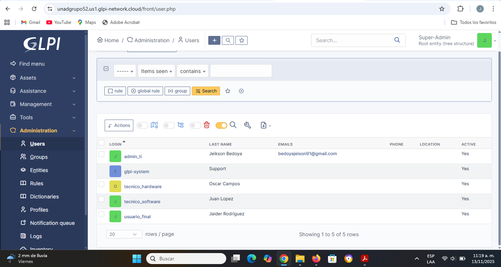
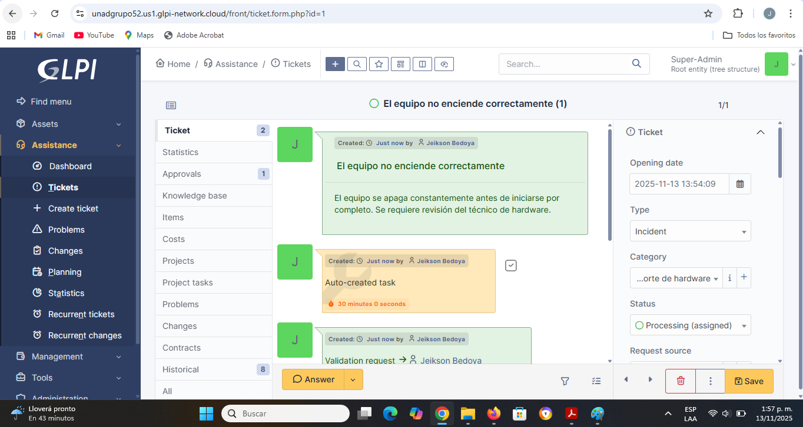
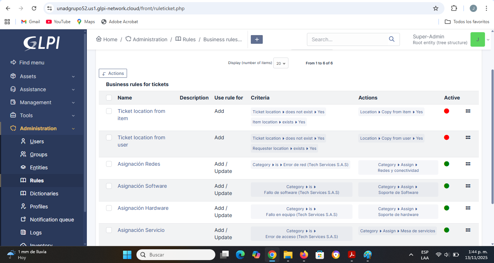
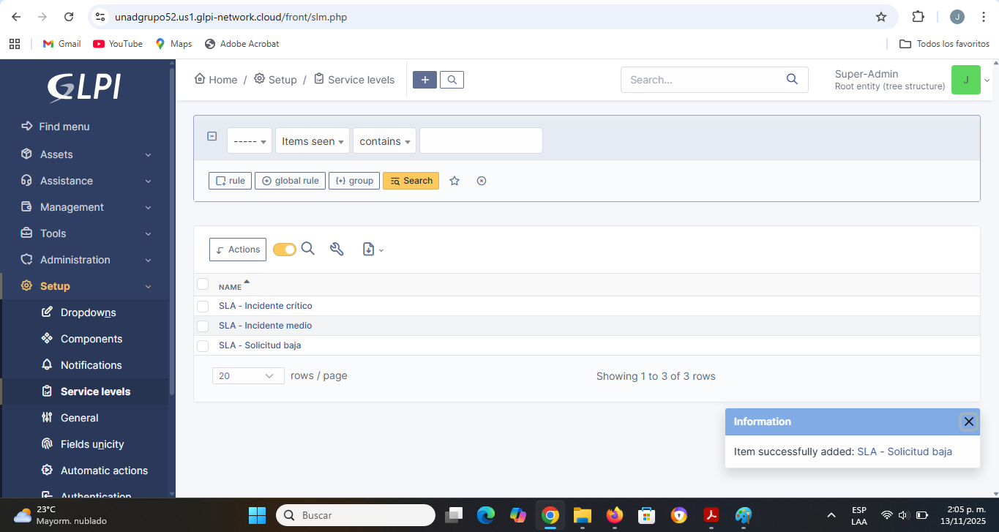
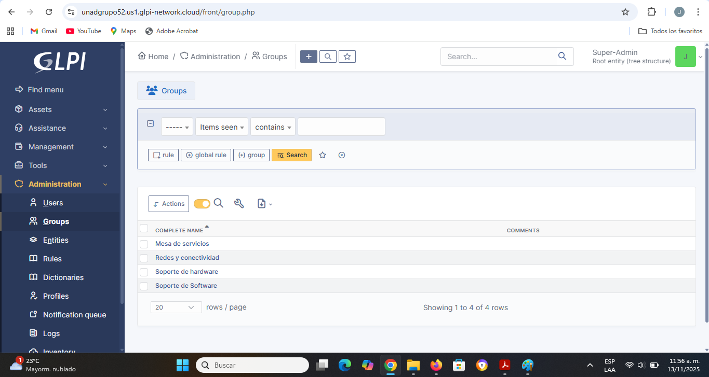
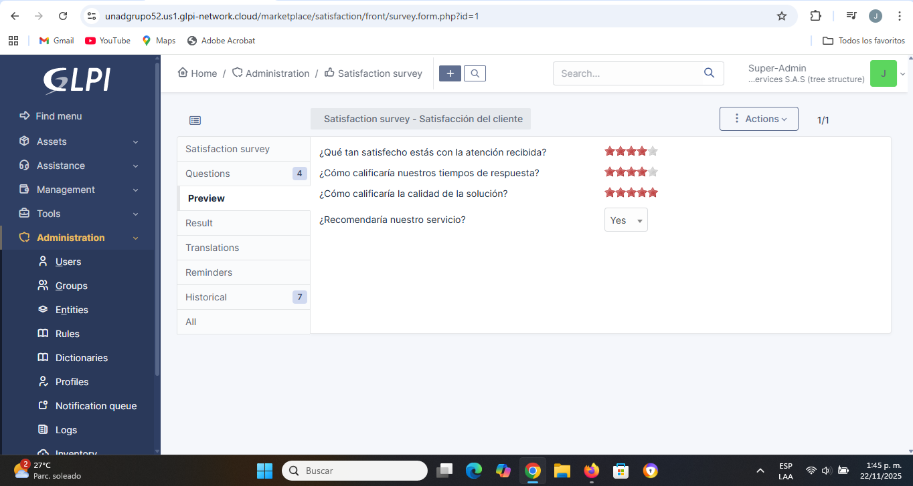

# 🎫 Mesa de Servicios TI con GLPI

## Descripción

Proyecto académico enfocado en la implementación de una mesa de servicios utilizando GLPI para la gestión de incidentes, solicitudes y procesos de soporte técnico.

La solución fue diseñada para la empresa ficticia Tech Services S.A.S. con el objetivo de centralizar la atención de requerimientos, automatizar procesos de asignación y medir el desempeño del servicio mediante indicadores de calidad y satisfacción.

---

## Objetivos

- Centralizar la gestión de incidentes y solicitudes.
- Definir acuerdos de nivel de servicio (SLA).
- Automatizar procesos de asignación de tickets.
- Gestionar usuarios, grupos y roles.
- Implementar indicadores para la mejora continua del servicio.

---

## Herramientas utilizadas

- GLPI
- Gestión de Servicios TI
- Service Desk
- SLA
- Gestión de Incidentes

---

# Configuración de la Mesa de Servicios

## Estructura organizacional

Se configuró la estructura de la organización mediante:

- Entidades.
- Grupos de soporte.
- Roles de usuario.
- Permisos de acceso.

---

## Gestión de Tickets

Se implementó la gestión completa de solicitudes mediante:

- Incidentes.
- Solicitudes de servicio.
- Problemas.

Los tickets podían ser creados, asignados, actualizados y cerrados dentro de la plataforma.

---

# Automatización

## Reglas de negocio

Se configuraron reglas automáticas para la asignación de tickets según la categoría registrada.

Ejemplo:

- Error de red → Grupo de Redes.
- Problema de software → Soporte de Software.

---

# Acuerdos de Nivel de Servicio (SLA)

Se definieron SLA para medir:

- Tiempo de respuesta.
- Tiempo de resolución.
- Cumplimiento del servicio.

---

# Indicadores de Desempeño

Se implementaron métricas para monitorear el funcionamiento de la mesa de servicios.

## KPIs utilizados

- Tickets abiertos.
- Tickets cerrados.
- Tickets en proceso.
- Tiempo promedio de respuesta.
- Tiempo promedio de resolución.
- Nivel de satisfacción del usuario.

---

# Satisfacción del Usuario

Se configuró una encuesta de satisfacción para recopilar la percepción de los usuarios respecto al servicio recibido.

Esta información permite identificar oportunidades de mejora y apoyar procesos de calidad.

---

# Gestión de Calidad y Mejora Continua

Como parte del proyecto se propuso un sistema de mejora continua basado en:

- Seguimiento de indicadores.
- Medición del desempeño del servicio.
- Evaluación de satisfacción del usuario.
- Identificación de oportunidades de mejora.

---

# Resultados obtenidos

- Centralización de la gestión de incidentes y solicitudes.
- Automatización de procesos de soporte.
- Implementación de acuerdos de nivel de servicio.
- Definición de indicadores de desempeño.
- Aplicación de mecanismos de mejora continua.
- Mayor control sobre la atención y seguimiento de requerimientos.

---

## Contenido del repositorio

- Capturas de configuración y operación de GLPI.
- Ejemplos de tickets y flujos de atención.
- Configuración de SLA.
- Gestión de usuarios y roles.
- Indicadores de desempeño y satisfacción.

---

## 👨‍💻 Autor

**Jeison Bedoya Gómez**

Proyecto desarrollado como parte de la formación en Ingeniería de Sistemas.
